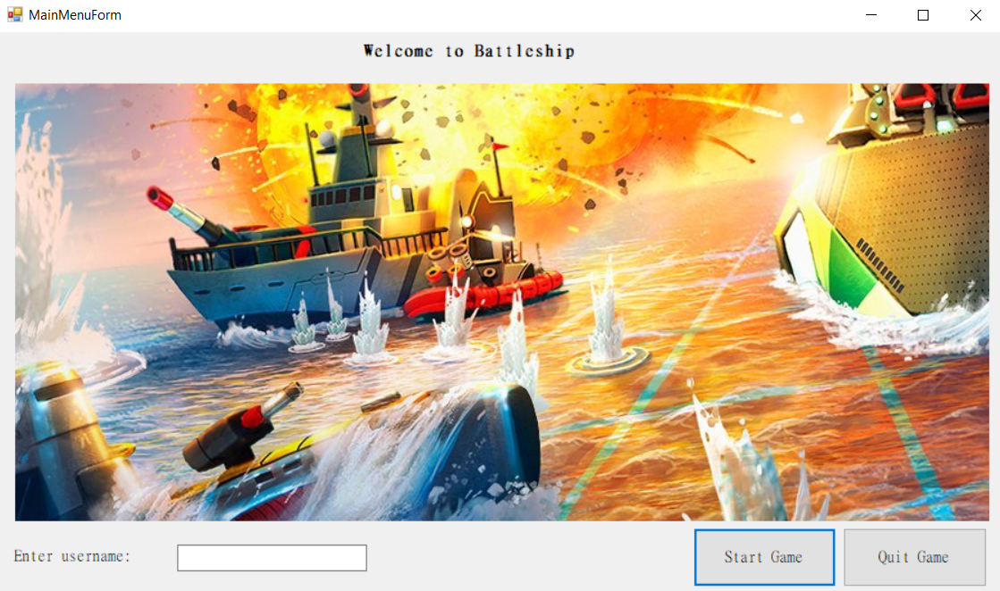
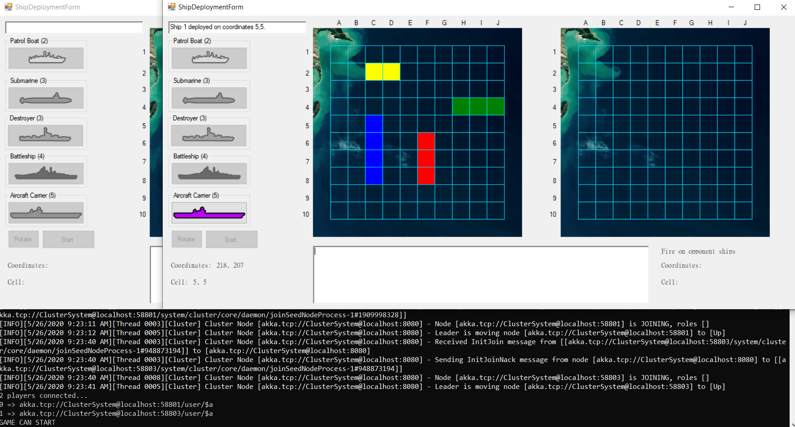
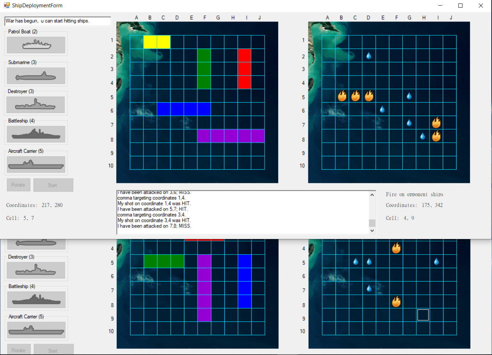

Implementation of Windows Forms Battleship game with Akka.NET

Application consists of 3 stages:

1st stage => subscribing players to server (cluster)

2nd stage => deploying ships onto board

3rd stage => sinking oppenent ships

